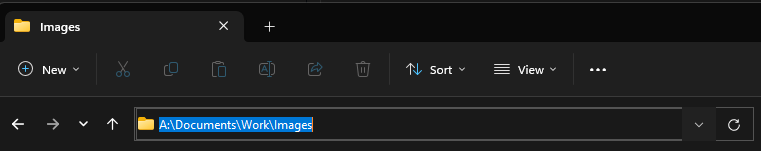
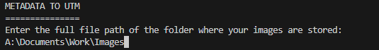

# Metadata to UTM extraction and conversion tool

MetadataToUTM is a very simple utility to extract embedded Latitude and Longitude GPS data from images, convert to a Universal Transverse Mercator projection if desired, and export to either .csv or .xslx file format.

## Usage

1. Run the executable found in the [latest release](https://github.com/theRealBassist/MetadataToUTM/releases) 
2. Copy the file path from the folder that contains your images. 
3. Right click to paste the file path into the prompt
4. Choose which coordinate system you desire. The "both" option will include both listed formats next to each other with Latitude/Longitude preceding UTM coordinates.
   1. NOTE: you must enter the characters as they are listed. E.g. `B` is invalid whereas `b` is valid.
5. Choose which output format you desire. 
6. You can then find your created `out.xlsx` or `out.csv` file in the folder alongside your images